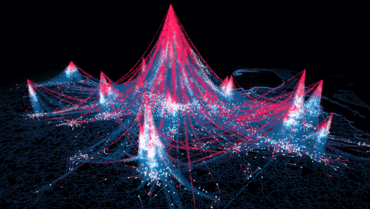
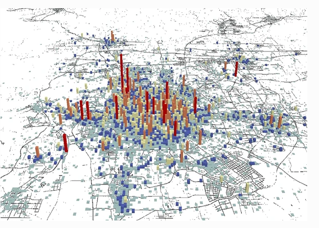
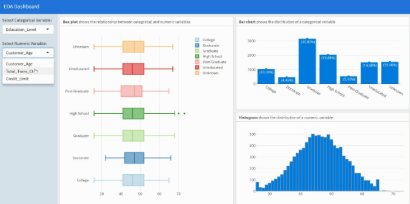
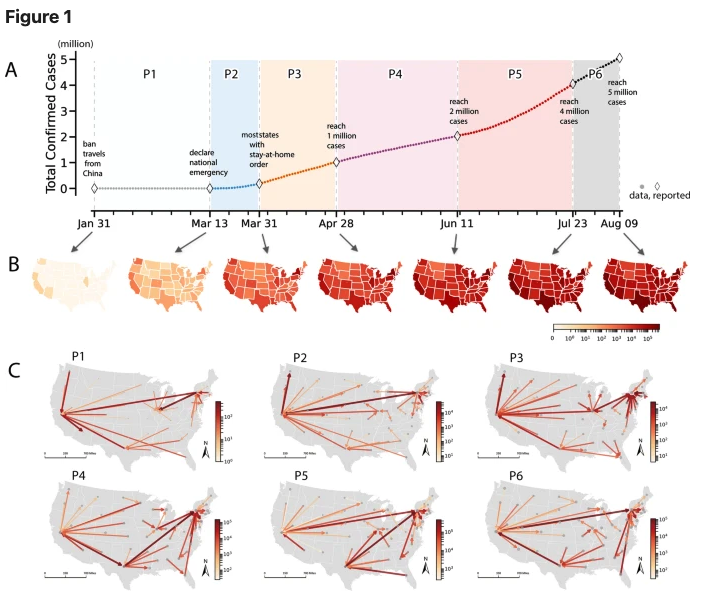

Project Proposal
================
Qingqing Chen
Last compiled date:15 October, 2021

## Identifying the Changes of Social Diversity in Auckland City under the COVID-19 Impacts

## Introduction

The COVID-19 virus has caused unprecedented impacts on people’s
day-to-day life, where cities around the world are still very much
suffering from the pandemic. In order to combat the pandemic, different
countries have implemented a series of stringent policies to mitigate
the transmission of the virus. Accompanying these preventive measures
are the potential changes in human movement trajectories. What does this
mean to the urban environment and social activities that we know before
the pandemic? How does human footprints change over time under the
impacts of the pandemic? With the new emerging big data techniques and
crowdsourcing techniques, a wealth of geospatial data, such as
location-based services (LBS), volunteered geographic information (VGI)
data, is becoming more and more available. This provides the potentials
for analyzing human mobility patterns at a much granular scale. In this
project, I aim to analyze human mobility patterns over time to identify
the potential changes of social diversity in Auckland city under the
pandemic by using mobile location data. The social diversity here refers
to the diversity of participants in an urban space.

## Questions

1.  How does social diversity change over time under the COVID-19
    pandemic?
2.  Where are the most diverse neighborhoods?
3.  Are the most diverse neighborhoods the same as that before the
    COVID-19 pandemic?  
4.  Are there any similar character(s) of neighborhoods with a high
    value of diversity?

## Inspiring Examples

### Example 1

This graphic is useful to demonstrate how people move around a city. The
links between two locations indicate the origin-to-destination networks
and the height gives a straightforward sense of where are the most
attractive places.
[(source)](https://cosmosmagazine.com/science/new-universal-law-of-human-mobility/)

An other similar example
[(source)](https://link.springer.com/article/10.1007/s11783-018-1068-1):

## Example 2

The interactive dashboard allows users to investigate underlying
insights of specific metrics from data or from measured results. User
can choose metrics that they are interested in and visualize results in
different way. This is especially useful in this project as the
interactive dashboard provides the flexibility to zoom in specific place
in the city and examine the metrics (e.g., social diversity, density) in
that place.
[(source)](https://towardsdatascience.com/create-an-interactive-dashboard-with-shiny-flexdashboard-and-plotly-b1f025aebc9c)

## Example 3

This example combines the timeline of the variable focused, the spatial
distribution, as well as the flow maps in different phases. This is a
good example to represent the (spatial) shifting patterns.
[(source)](https://www.nature.com/articles/s41598-021-87902-8)

## Proposed data sources

A anonymized mobile location data collected in Auckland city from 2019
to 2020 is used in this project. The data is provided by a third party
named [Quadrant](https://www.quadrant.io/), which is a global leader in
mobile location data, POI data, and corresponding compliance services.
The data contains three variables as listed below:

-   **User ID**: the unique identifier for each mobile phone user
-   **Timestamp**: the specific timestamp for each data point created.  
-   **Location**: the location of each data point created.

As the entitle data set has millions of data points. A random sample is
generated, which is used in this project (the link for accessing the
sampled data set will be shared later).

## Proposed methods

1.  Shannon’s index (Tramer 1969; Maignan et al. 2003) will be used to
    analyze the social diversity
2.  Spatial distribution of social diversity will be presented to
    visualize and compare the changes of social diversity.
3.  An interactive dashboard will be designed to dive into each
    neighborhood for understanding where participants in an urban space
    come from.

## Expected results

1.  The social diversity does change under the COVID-19 impacts.
2.  The diversity around CDB may have a significant change.
3.  Neighborhoods with relatively high diversity may have similar
    character(s) or certain urban functions.
4.  The most dense place may not be the most diverse place.

## References

Maignan, Carole, Gianmarco Ottaviano, Dino Pinelli, and Francesco
Rullani. 2003. “Bio-Ecological Diversity Vs. Socio-Economic Diversity: A
Comparison of Existing Measures.” 2003.13. Fondazione Eni Enrico Mattei.
<https://ideas.repec.org/p/fem/femwpa/2003.13.html>.

Tramer, Elliot J. 1969. “Bird Species Diversity: Components of Shannon’s
Formula.” *Ecology* 50 (5): 927–29. <https://doi.org/10.2307/1933715>.

