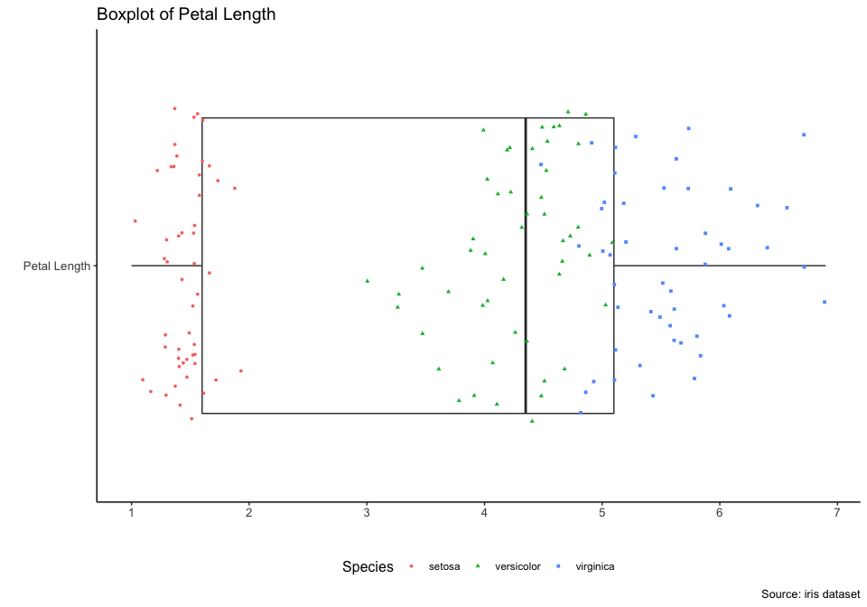

Case Study 01: Your first script
================
Qingqing Chen
Last compiled on 17 September, 2021

## Load data

``` r
data(iris)
head(iris)
```

    ##   Sepal.Length Sepal.Width Petal.Length Petal.Width Species
    ## 1          5.1         3.5          1.4         0.2  setosa
    ## 2          4.9         3.0          1.4         0.2  setosa
    ## 3          4.7         3.2          1.3         0.2  setosa
    ## 4          4.6         3.1          1.5         0.2  setosa
    ## 5          5.0         3.6          1.4         0.2  setosa
    ## 6          5.4         3.9          1.7         0.4  setosa

## Overview data

-   See variables in the data

``` r
str(iris)
```

    ## 'data.frame':    150 obs. of  5 variables:
    ##  $ Sepal.Length: num  5.1 4.9 4.7 4.6 5 5.4 4.6 5 4.4 4.9 ...
    ##  $ Sepal.Width : num  3.5 3 3.2 3.1 3.6 3.9 3.4 3.4 2.9 3.1 ...
    ##  $ Petal.Length: num  1.4 1.4 1.3 1.5 1.4 1.7 1.4 1.5 1.4 1.5 ...
    ##  $ Petal.Width : num  0.2 0.2 0.2 0.2 0.2 0.4 0.3 0.2 0.2 0.1 ...
    ##  $ Species     : Factor w/ 3 levels "setosa","versicolor",..: 1 1 1 1 1 1 1 1 1 1 ...

-   Statisitcal summary of the data

-   Overview

``` r
Hmisc::describe(iris)
```

    ## iris 
    ## 
    ##  5  Variables      150  Observations
    ## --------------------------------------------------------------------------------
    ## Sepal.Length 
    ##        n  missing distinct     Info     Mean      Gmd      .05      .10 
    ##      150        0       35    0.998    5.843   0.9462    4.600    4.800 
    ##      .25      .50      .75      .90      .95 
    ##    5.100    5.800    6.400    6.900    7.255 
    ## 
    ## lowest : 4.3 4.4 4.5 4.6 4.7, highest: 7.3 7.4 7.6 7.7 7.9
    ## --------------------------------------------------------------------------------
    ## Sepal.Width 
    ##        n  missing distinct     Info     Mean      Gmd      .05      .10 
    ##      150        0       23    0.992    3.057   0.4872    2.345    2.500 
    ##      .25      .50      .75      .90      .95 
    ##    2.800    3.000    3.300    3.610    3.800 
    ## 
    ## lowest : 2.0 2.2 2.3 2.4 2.5, highest: 3.9 4.0 4.1 4.2 4.4
    ## --------------------------------------------------------------------------------
    ## Petal.Length 
    ##        n  missing distinct     Info     Mean      Gmd      .05      .10 
    ##      150        0       43    0.998    3.758    1.979     1.30     1.40 
    ##      .25      .50      .75      .90      .95 
    ##     1.60     4.35     5.10     5.80     6.10 
    ## 
    ## lowest : 1.0 1.1 1.2 1.3 1.4, highest: 6.3 6.4 6.6 6.7 6.9
    ## --------------------------------------------------------------------------------
    ## Petal.Width 
    ##        n  missing distinct     Info     Mean      Gmd      .05      .10 
    ##      150        0       22     0.99    1.199   0.8676      0.2      0.2 
    ##      .25      .50      .75      .90      .95 
    ##      0.3      1.3      1.8      2.2      2.3 
    ## 
    ## lowest : 0.1 0.2 0.3 0.4 0.5, highest: 2.1 2.2 2.3 2.4 2.5
    ## --------------------------------------------------------------------------------
    ## Species 
    ##        n  missing distinct 
    ##      150        0        3 
    ##                                            
    ## Value          setosa versicolor  virginica
    ## Frequency          50         50         50
    ## Proportion      0.333      0.333      0.333
    ## --------------------------------------------------------------------------------

## EDA

### Mean value of Sepal.Length

``` r
petal_length_mean <- mean(iris$Petal.Length)
petal_length_mean
```

    ## [1] 3.758

### Visualization

#### Histogram

``` r
ggplot(iris, aes(Petal.Length)) +
  geom_histogram(fill = "blue", color = "black", alpha = 0.6) + 
  geom_vline(xintercept = petal_length_mean, color = "red", linetype = "longdash", size = 0.8) + 
  annotate("text", x = petal_length_mean + 0.5, y = 27, label = paste0("Mean (", round(petal_length_mean, 2), ")"), size = 4) +
  labs(x = "Petal Length", y = "Count", title = "Distribution of Petal Length", caption = "Source: iris dataset") + 
  theme_classic() +
  theme(axis.text = element_text(size = 10), 
        title = element_text(size = 12)) +
  scale_x_continuous(breaks = seq(0, 10, 0.5)) +
  scale_y_continuous(breaks = seq(0, 30, 2))
```

<!-- -->

#### Histogram by species

``` r
ggplot(iris, aes(Petal.Length, fill = Species)) +
  geom_histogram(color = "black",  alpha = 0.6) + 
  labs(x = "Petal Length", y = "Count", title = "Distribution of Petal Length", caption = "Source: iris dataset") + 
  facet_grid(Species ~ ., scales = "free") +
  theme_classic() +
  theme(axis.text = element_text(size = 10), 
        title = element_text(size = 12), 
        legend.position = "none") +
  scale_x_continuous(breaks = seq(0, 10, 0.5)) +
  scale_y_continuous(breaks = seq(0, 30, 2))
```

<!-- -->

#### Boxplot

``` r
iris %>% 
  dplyr::select(Petal.Length, Species) %>% 
  mutate(name = "Petal Length") %>% 
  ggplot(., aes(x = name, y = Petal.Length)) +
  geom_boxplot() +
  geom_jitter(aes(color = Species, shape = Species), size=1, width = 0.4) + 
  labs(x = "", y = "", title = "Boxplot of Petal Length", caption = "Source: iris dataset") + 
  coord_flip() +
  theme_classic() +
  theme(axis.text = element_text(size = 10), 
        title = element_text(size = 12), 
        legend.position = "bottom") +
  scale_y_continuous(breaks = seq(0, 10, 1))
```

<!-- -->
