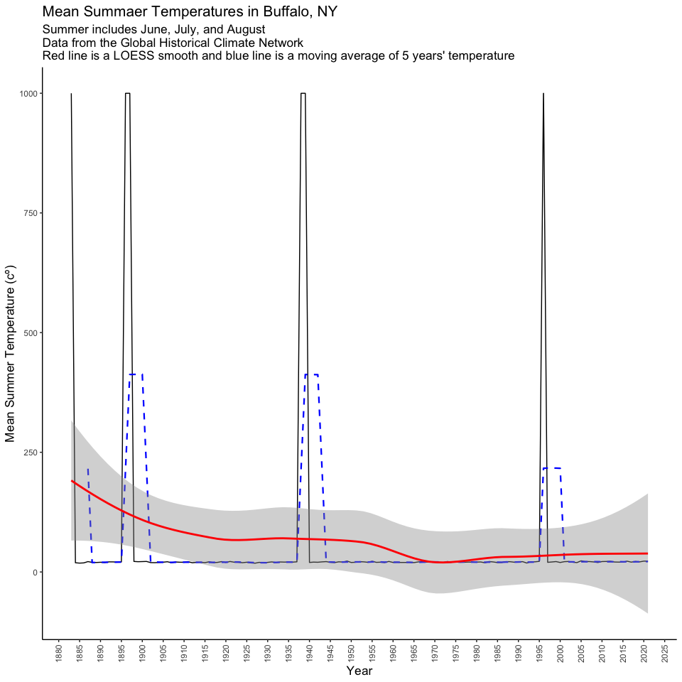

Case Study 02: My grandfather says summers are getting hotter
================
Qingqing Chen
17 September, 2021

## Load data

``` r
# define the link to the data - you can try this in your browser too.  Note that the URL ends in .txt.
dataurl <- "https://data.giss.nasa.gov/tmp/gistemp/STATIONS/tmp_USW00014733_14_0_1/station.txt"
temp <- read_table(dataurl, 
                   skip = 2, # skip the first two lines
                   na = "999.90",
                   progress = F) %>% 
  clean_names() 
head(temp)
```

    ## # A tibble: 6 × 18
    ##    year   jan    feb   mar   apr   may   jun   jul   aug   sep   oct   nov   dec
    ##   <dbl> <dbl>  <dbl> <dbl> <dbl> <dbl> <dbl> <dbl> <dbl> <dbl> <dbl> <dbl> <dbl>
    ## 1  1883 NA     NA    NA    NA     NA    NA    NA    NA    NA   NA     5.93  0.46
    ## 2  1884 -8.38  -2.96 -1.5   4.32  11.5  19.2  18.5  19.9  18.5 10.9   3.03 -1.44
    ## 3  1885 -6.68 -10.1  -6.65  4.57  12.1  16.0  21.2  18.3  15.5  9.81  4.63 -0.78
    ## 4  1886 -5.63  -4.65 -0.16  8.22  11.9  17.4  20.0  19.5  17.2 11.1   3.08 -4.45
    ## 5  1887 -5.69  -3.42 -2.21  4.6   17.4  19.7  24.6  20.6  15.6  9.22  3.89 -0.18
    ## 6  1888 -7.47  -4.15 -2.94  4.33  12.8  18.9  20.7  20.6  15.6  7.77  5.09 -0.24
    ## # … with 5 more variables: d_j_f <dbl>, m_a_m <dbl>, j_j_a <dbl>, s_o_n <dbl>,
    ## #   met_ann <dbl>

## EDA

``` r
names(temp)
```

    ##  [1] "year"    "jan"     "feb"     "mar"     "apr"     "may"     "jun"    
    ##  [8] "jul"     "aug"     "sep"     "oct"     "nov"     "dec"     "d_j_f"  
    ## [15] "m_a_m"   "j_j_a"   "s_o_n"   "met_ann"

``` r
glimpse(temp)
```

    ## Rows: 139
    ## Columns: 18
    ## $ year    <dbl> 1883, 1884, 1885, 1886, 1887, 1888, 1889, 1890, 1891, 1892, 18…
    ## $ jan     <dbl> NA, -8.38, -6.68, -5.63, -5.69, -7.47, -1.02, 0.62, -2.18, -4.…
    ## $ feb     <dbl> NA, -2.96, -10.06, -4.65, -3.42, -4.15, -7.16, 0.05, -0.51, -1…
    ## $ mar     <dbl> NA, -1.50, -6.65, -0.16, -2.21, -2.94, 1.30, -1.10, -0.10, -1.…
    ## $ apr     <dbl> NA, 4.32, 4.57, 8.22, 4.60, 4.33, 6.72, 6.92, 6.86, 5.56, 5.34…
    ## $ may     <dbl> NA, 11.49, 12.09, 11.94, 17.40, 12.75, 13.18, 11.69, 11.38, 11…
    ## $ jun     <dbl> NA, 19.25, 16.04, 17.40, 19.71, 18.86, 17.35, 19.90, 19.34, 19…
    ## $ jul     <dbl> NA, 18.52, 21.16, 20.02, 24.62, 20.68, 21.82, 21.62, 19.26, 21…
    ## $ aug     <dbl> NA, 19.94, 18.29, 19.48, 20.65, 20.55, 20.29, 19.43, 20.53, 21…
    ## $ sep     <dbl> NA, 18.49, 15.49, 17.19, 15.55, 15.55, 17.54, 16.04, 18.98, 17…
    ## $ oct     <dbl> NA, 10.91, 9.81, 11.06, 9.22, 7.77, 7.76, 10.46, 10.49, 10.59,…
    ## $ nov     <dbl> 5.93, 3.03, 4.63, 3.08, 3.89, 5.09, 5.08, 4.43, 4.37, 2.82, 4.…
    ## $ dec     <dbl> 0.46, -1.44, -0.78, -4.45, -0.18, -0.24, 3.46, -3.20, 2.95, -2…
    ## $ d_j_f   <dbl> NA, -3.63, -6.06, -3.69, -4.52, -3.93, -2.81, 1.38, -1.96, -1.…
    ## $ m_a_m   <dbl> NA, 4.77, 3.34, 6.67, 6.60, 4.71, 7.07, 5.84, 6.05, 5.33, 5.70…
    ## $ j_j_a   <dbl> NA, 19.24, 18.50, 18.97, 21.66, 20.03, 19.82, 20.32, 19.71, 21…
    ## $ s_o_n   <dbl> NA, 10.81, 9.98, 10.44, 9.55, 9.47, 10.13, 10.31, 11.28, 10.23…
    ## $ met_ann <dbl> NA, 7.80, 6.44, 8.10, 8.32, 7.57, 8.55, 9.46, 8.77, 8.85, 8.11…

``` r
summary(temp)
```

    ##       year           jan              feb               mar         
    ##  Min.   :1883   Min.   :-9.910   Min.   :-11.480   Min.   :-6.6500  
    ##  1st Qu.:1918   1st Qu.:-5.720   1st Qu.: -5.570   1st Qu.:-0.6575  
    ##  Median :1952   Median :-3.670   Median : -3.720   Median : 0.8100  
    ##  Mean   :1952   Mean   :-3.703   Mean   : -3.737   Mean   : 0.9393  
    ##  3rd Qu.:1986   3rd Qu.:-1.770   3rd Qu.: -1.680   3rd Qu.: 2.3675  
    ##  Max.   :2021   Max.   : 3.040   Max.   :  1.750   Max.   : 8.7700  
    ##                 NA's   :6        NA's   :6         NA's   :5        
    ##       apr              may             jun             jul       
    ##  Min.   : 1.960   Min.   : 9.12   Min.   :15.54   Min.   :18.52  
    ##  1st Qu.: 5.765   1st Qu.:12.12   1st Qu.:18.28   1st Qu.:21.08  
    ##  Median : 7.235   Median :13.18   Median :19.15   Median :21.83  
    ##  Mean   : 7.139   Mean   :13.55   Mean   :19.06   Mean   :21.91  
    ##  3rd Qu.: 8.560   3rd Qu.:14.96   3rd Qu.:19.87   3rd Qu.:22.59  
    ##  Max.   :10.980   Max.   :18.37   Max.   :22.97   Max.   :25.36  
    ##  NA's   :5        NA's   :6       NA's   :6       NA's   :7      
    ##       aug             sep             oct             nov       
    ##  Min.   :18.29   Min.   :13.76   Min.   : 6.40   Min.   :1.390  
    ##  1st Qu.:20.29   1st Qu.:16.43   1st Qu.:10.04   1st Qu.:3.720  
    ##  Median :20.86   Median :17.28   Median :11.29   Median :4.780  
    ##  Mean   :21.04   Mean   :17.34   Mean   :11.20   Mean   :4.897  
    ##  3rd Qu.:21.92   3rd Qu.:18.36   3rd Qu.:12.23   3rd Qu.:6.050  
    ##  Max.   :24.32   Max.   :20.69   Max.   :16.20   Max.   :9.020  
    ##  NA's   :7       NA's   :8       NA's   :9       NA's   :8      
    ##       dec              d_j_f            m_a_m            j_j_a      
    ##  Min.   :-8.0000   Min.   :-6.870   Min.   : 3.310   Min.   :18.35  
    ##  1st Qu.:-2.4950   1st Qu.:-3.770   1st Qu.: 6.110   1st Qu.:19.93  
    ##  Median :-0.9700   Median :-2.810   Median : 7.210   Median :20.60  
    ##  Mean   :-0.9232   Mean   :-2.792   Mean   : 7.213   Mean   :20.67  
    ##  3rd Qu.: 0.8350   3rd Qu.:-1.860   3rd Qu.: 8.200   3rd Qu.:21.42  
    ##  Max.   : 5.7300   Max.   : 1.660   Max.   :11.400   Max.   :23.25  
    ##  NA's   :9         NA's   :6        NA's   :5        NA's   :6      
    ##      s_o_n          met_ann      
    ##  Min.   : 8.44   Min.   : 6.440  
    ##  1st Qu.:10.41   1st Qu.: 8.510  
    ##  Median :11.07   Median : 8.980  
    ##  Mean   :11.14   Mean   : 9.053  
    ##  3rd Qu.:11.83   3rd Qu.: 9.530  
    ##  Max.   :13.90   Max.   :11.320  
    ##  NA's   :9       NA's   :6

### Create a subset

``` r
temp_jja <- temp %>% 
  dplyr::select(year, j_j_a) %>%
  rename(JJA = j_j_a) %>% 
  mutate(JJA = if_else(is.na(JJA), mean(JJA, na.rm = T), JJA)) %>%
  mutate(avg_5year = SMA(JJA, n = 5)) 
```

### Visualization

``` r
ggplot(temp_jja) +
  geom_line(aes(x = year, y = JJA, group = 1)) +
  geom_line(aes(x = year, y = avg_5year, group = 1), color = "blue", linetype = 2, lwd = 0.8) +
  geom_smooth(aes(x = year, y = JJA, group = 1), col = "red") +
  scale_x_continuous(breaks = seq(1880, 2025, 5)) +
  labs(x = "Year", y = "Mean Summer Temperature (cº)",
       title = "Mean Summaer Temperatures in Buffalo, NY",
       subtitle = "Summer includes June, July, and August \nData from the Global Historical Climate Network \nRed line is a LOESS smooth and blue line is a moving average of 5 years' temperature") +
  theme_classic() +
  theme(title = element_text(size = 13), 
        axis.text.x = element_text(angle = 90, vjust = 0.5))
```

<!-- -->
