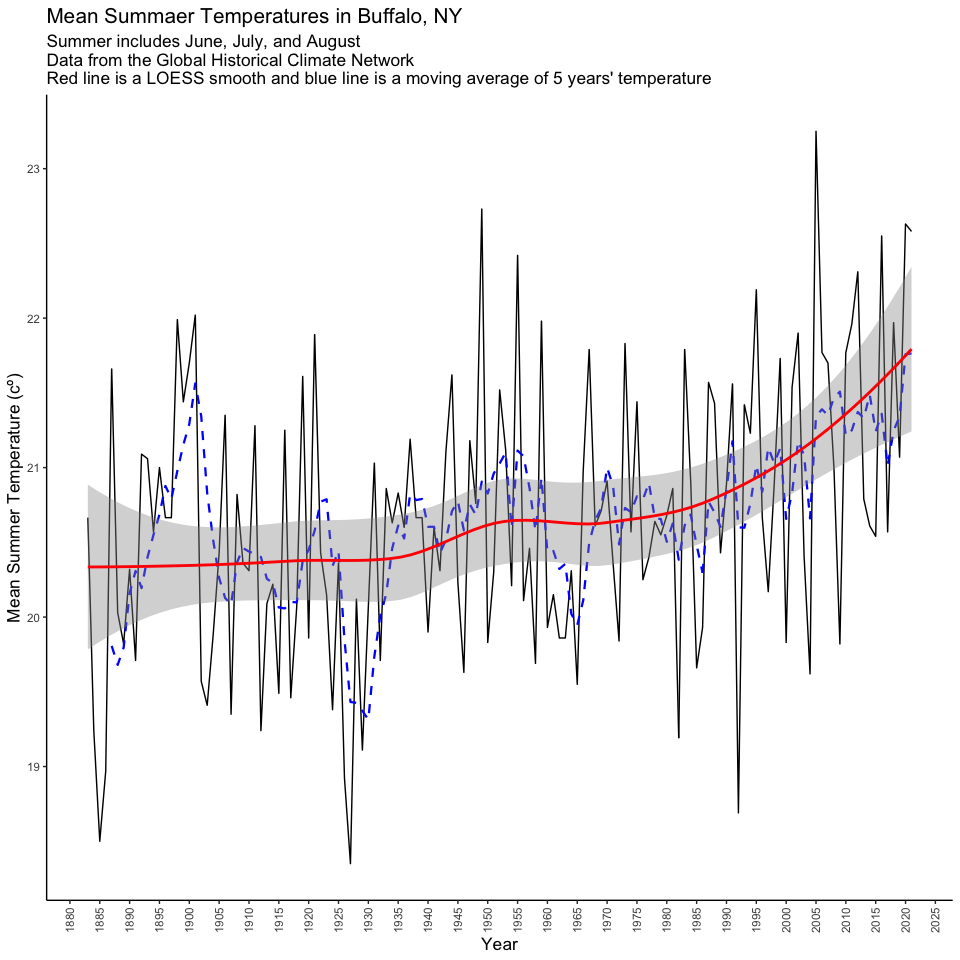

Case Study 02: My grandfather says summers are getting hotter
================
Qingqing Chen
28 September, 2021

## Load data

``` r
# define the link to the data - you can try this in your browser too.  Note that the URL ends in .txt.
# dataurl <- "https://data.giss.nasa.gov/cgi-bin/gistemp/stdata_show_v4.cgi?id=USW00014733&ds=14&dt=1"
# temp <- read_table(dataurl, 
#                    skip = 2, # skip the first two lines
#                    na = "999.90",
#                    progress = F) %>% 
#   clean_names() 
temp <- read_csv(here::here("data/cs2_station.csv")) %>% clean_names() 
head(temp)
```

    ## # A tibble: 6 × 18
    ##    year     jan     feb     mar    apr    may    jun    jul    aug    sep    oct
    ##   <dbl>   <dbl>   <dbl>   <dbl>  <dbl>  <dbl>  <dbl>  <dbl>  <dbl>  <dbl>  <dbl>
    ## 1  1883 1000.   1000.   1000.   1.00e3 1000.  1000.  1000.  1000.  1000.  1.00e3
    ## 2  1884   -8.38   -2.96   -1.5  4.32e0   11.5   19.2   18.5   19.9   18.5 1.09e1
    ## 3  1885   -6.68  -10.1    -6.65 4.57e0   12.1   16.0   21.2   18.3   15.5 9.81e0
    ## 4  1886   -5.63   -4.65   -0.16 8.22e0   11.9   17.4   20.0   19.5   17.2 1.11e1
    ## 5  1887   -5.69   -3.42   -2.21 4.6 e0   17.4   19.7   24.6   20.6   15.6 9.22e0
    ## 6  1888   -7.47   -4.15   -2.94 4.33e0   12.8   18.9   20.7   20.6   15.6 7.77e0
    ## # … with 7 more variables: nov <dbl>, dec <dbl>, d_j_f <dbl>, m_a_m <dbl>,
    ## #   j_j_a <dbl>, s_o_n <dbl>, met_ann <dbl>

## EDA

``` r
names(temp)
```

    ##  [1] "year"    "jan"     "feb"     "mar"     "apr"     "may"     "jun"    
    ##  [8] "jul"     "aug"     "sep"     "oct"     "nov"     "dec"     "d_j_f"  
    ## [15] "m_a_m"   "j_j_a"   "s_o_n"   "met_ann"

``` r
glimpse(temp)
```

    ## Rows: 139
    ## Columns: 18
    ## $ year    <dbl> 1883, 1884, 1885, 1886, 1887, 1888, 1889, 1890, 1891, 1892, 18…
    ## $ jan     <dbl> 999.90, -8.38, -6.68, -5.63, -5.69, -7.47, -1.02, 0.62, -2.18,…
    ## $ feb     <dbl> 999.90, -2.96, -10.06, -4.65, -3.42, -4.15, -7.16, 0.05, -0.51…
    ## $ mar     <dbl> 999.90, -1.50, -6.65, -0.16, -2.21, -2.94, 1.30, -1.10, -0.10,…
    ## $ apr     <dbl> 999.90, 4.32, 4.57, 8.22, 4.60, 4.33, 6.72, 6.92, 6.86, 5.56, …
    ## $ may     <dbl> 999.90, 11.49, 12.09, 11.94, 17.40, 12.75, 13.18, 11.69, 11.38…
    ## $ jun     <dbl> 999.90, 19.25, 16.04, 17.40, 19.71, 18.86, 17.35, 19.90, 19.34…
    ## $ jul     <dbl> 999.90, 18.52, 21.16, 20.02, 24.62, 20.68, 21.82, 21.62, 19.26…
    ## $ aug     <dbl> 999.90, 19.94, 18.29, 19.48, 20.65, 20.55, 20.29, 19.43, 20.53…
    ## $ sep     <dbl> 999.90, 18.49, 15.49, 17.19, 15.55, 15.55, 17.54, 16.04, 18.98…
    ## $ oct     <dbl> 999.90, 10.91, 9.81, 11.06, 9.22, 7.77, 7.76, 10.46, 10.49, 10…
    ## $ nov     <dbl> 5.93, 3.03, 4.63, 3.08, 3.89, 5.09, 5.08, 4.43, 4.37, 2.82, 4.…
    ## $ dec     <dbl> 0.46, -1.44, -0.78, -4.45, -0.18, -0.24, 3.46, -3.20, 2.95, -2…
    ## $ d_j_f   <dbl> 999.90, -3.63, -6.06, -3.69, -4.52, -3.93, -2.81, 1.38, -1.96,…
    ## $ m_a_m   <dbl> 999.90, 4.77, 3.34, 6.67, 6.60, 4.71, 7.07, 5.84, 6.05, 5.33, …
    ## $ j_j_a   <dbl> 999.90, 19.24, 18.50, 18.97, 21.66, 20.03, 19.82, 20.32, 19.71…
    ## $ s_o_n   <dbl> 999.90, 10.81, 9.98, 10.44, 9.55, 9.47, 10.13, 10.31, 11.28, 1…
    ## $ met_ann <dbl> 999.90, 7.80, 6.44, 8.10, 8.32, 7.57, 8.55, 9.46, 8.77, 8.85, …

``` r
summary(temp)
```

    ##       year           jan               feb               mar         
    ##  Min.   :1883   Min.   : -9.910   Min.   :-11.480   Min.   : -6.650  
    ##  1st Qu.:1918   1st Qu.: -5.690   1st Qu.: -5.485   1st Qu.: -0.645  
    ##  Median :1952   Median : -3.560   Median : -3.560   Median :  0.840  
    ##  Mean   :1952   Mean   : 39.618   Mean   : 39.585   Mean   : 36.873  
    ##  3rd Qu.:1986   3rd Qu.: -1.255   3rd Qu.: -1.410   3rd Qu.:  2.565  
    ##  Max.   :2021   Max.   :999.900   Max.   :999.900   Max.   :999.900  
    ##       apr               may              jun              jul        
    ##  Min.   :  1.960   Min.   :  9.12   Min.   : 15.54   Min.   : 18.52  
    ##  1st Qu.:  5.870   1st Qu.: 12.19   1st Qu.: 18.31   1st Qu.: 21.18  
    ##  Median :  7.320   Median : 13.43   Median : 19.23   Median : 21.86  
    ##  Mean   : 42.850   Mean   : 56.13   Mean   : 61.40   Mean   : 71.16  
    ##  3rd Qu.:  8.625   3rd Qu.: 15.18   3rd Qu.: 19.94   3rd Qu.: 22.70  
    ##  Max.   :999.900   Max.   :999.90   Max.   :999.90   Max.   :999.90  
    ##       aug              sep              oct              nov         
    ##  Min.   : 18.29   Min.   : 13.76   Min.   :  6.40   Min.   :  1.390  
    ##  1st Qu.: 20.33   1st Qu.: 16.50   1st Qu.: 10.09   1st Qu.:  3.795  
    ##  Median : 21.04   Median : 17.45   Median : 11.42   Median :  4.880  
    ##  Mean   : 70.33   Mean   : 73.89   Mean   : 75.21   Mean   : 62.164  
    ##  3rd Qu.: 22.15   3rd Qu.: 18.49   3rd Qu.: 12.45   3rd Qu.:  6.195  
    ##  Max.   :999.90   Max.   :999.90   Max.   :999.90   Max.   :999.900  
    ##       dec             d_j_f             m_a_m            j_j_a       
    ##  Min.   : -8.00   Min.   : -6.870   Min.   :  3.31   Min.   : 18.35  
    ##  1st Qu.: -2.40   1st Qu.: -3.735   1st Qu.:  6.12   1st Qu.: 20.05  
    ##  Median : -0.71   Median : -2.760   Median :  7.29   Median : 20.61  
    ##  Mean   : 63.88   Mean   : 40.489   Mean   : 42.92   Mean   : 62.93  
    ##  3rd Qu.:  1.04   3rd Qu.: -1.475   3rd Qu.:  8.32   3rd Qu.: 21.53  
    ##  Max.   :999.90   Max.   :999.900   Max.   :999.90   Max.   :999.90  
    ##      s_o_n           met_ann       
    ##  Min.   :  8.44   Min.   :  6.440  
    ##  1st Qu.: 10.44   1st Qu.:  8.515  
    ##  Median : 11.12   Median :  9.020  
    ##  Mean   : 75.16   Mean   : 51.824  
    ##  3rd Qu.: 12.07   3rd Qu.:  9.590  
    ##  Max.   :999.90   Max.   :999.900

### Create a subset

``` r
mean_jja <- mean(temp[which(temp$j_j_a != 999.90), ]$j_j_a)

temp_jja <- temp %>% 
  dplyr::select(year, j_j_a) %>%
  rename(JJA = j_j_a) %>% 
  mutate(JJA = if_else(JJA == 999.90, mean_jja, JJA)) %>%
  mutate(avg_5year = SMA(JJA, n = 5)) 
```

### Visualization

``` r
ggplot(temp_jja) +
  geom_line(aes(x = year, y = JJA, group = 1)) +
  geom_line(aes(x = year, y = avg_5year, group = 1), color = "blue", linetype = 2, lwd = 0.8) +
  geom_smooth(aes(x = year, y = JJA, group = 1), col = "red") +
  scale_x_continuous(breaks = seq(1880, 2025, 5)) +
  labs(x = "Year", y = "Mean Summer Temperature (cº)",
       title = "Mean Summaer Temperatures in Buffalo, NY",
       subtitle = "Summer includes June, July, and August \nData from the Global Historical Climate Network \nRed line is a LOESS smooth and blue line is a moving average of 5 years' temperature") +
  theme_classic() +
  theme(title = element_text(size = 13), 
        axis.text.x = element_text(angle = 90, vjust = 0.5))
```

<!-- -->
