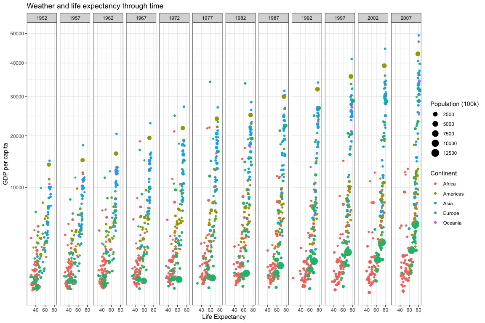
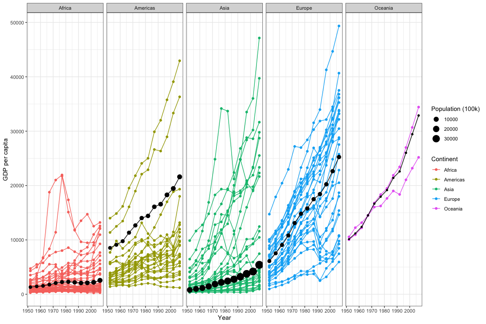

Case Study 03: Wealth over time
================
Qingqing Chen
23 September, 2021

## Load data

``` r
data(gapminder)
df_sub <- gapminder %>% 
  filter(country != "Kuwait")

head(df_sub)
```

    ## # A tibble: 6 × 6
    ##   country     continent  year lifeExp      pop gdpPercap
    ##   <fct>       <fct>     <int>   <dbl>    <int>     <dbl>
    ## 1 Afghanistan Asia       1952    28.8  8425333      779.
    ## 2 Afghanistan Asia       1957    30.3  9240934      821.
    ## 3 Afghanistan Asia       1962    32.0 10267083      853.
    ## 4 Afghanistan Asia       1967    34.0 11537966      836.
    ## 5 Afghanistan Asia       1972    36.1 13079460      740.
    ## 6 Afghanistan Asia       1977    38.4 14880372      786.

``` r
glimpse(df_sub)
```

    ## Rows: 1,692
    ## Columns: 6
    ## $ country   <fct> "Afghanistan", "Afghanistan", "Afghanistan", "Afghanistan", …
    ## $ continent <fct> Asia, Asia, Asia, Asia, Asia, Asia, Asia, Asia, Asia, Asia, …
    ## $ year      <int> 1952, 1957, 1962, 1967, 1972, 1977, 1982, 1987, 1992, 1997, …
    ## $ lifeExp   <dbl> 28.801, 30.332, 31.997, 34.020, 36.088, 38.438, 39.854, 40.8…
    ## $ pop       <int> 8425333, 9240934, 10267083, 11537966, 13079460, 14880372, 12…
    ## $ gdpPercap <dbl> 779.4453, 820.8530, 853.1007, 836.1971, 739.9811, 786.1134, …

``` r
ggplot(df_sub) +
  geom_point(aes(x = lifeExp, y = gdpPercap, size=pop/100000, color = continent)) + 
  facet_wrap(~year, nrow = 1) +
  scale_y_sqrt() +  # similar to scale_y_continuous(trans = "sqrt") 
  theme_bw() + 
  labs(x = "Life Expectancy", y = "GDP per capita", size = "Population (100k)", color = "Continent", 
       title = "Weather and life expectancy through time")
```

<!-- -->

``` r
ggsave(here::here("week_03/plot1.png"), device = "png", width = 15)
```

``` r
gapminder_continent <- df_sub %>% 
  group_by(continent, year) %>% 
  dplyr::summarise(gdpPercapweighted = weighted.mean(x = gdpPercap, w = pop), 
                   pop = sum(as.numeric(pop)))

ggplot(df_sub) +
  geom_line(aes(x = year, y = gdpPercap, color = continent, group = country)) +
  geom_point(aes(x = year, y = gdpPercap, color = continent, group = country)) +
  geom_point(data = gapminder_continent, aes(x = year, y = gdpPercapweighted, size = pop/100000)) + 
  geom_line(data = gapminder_continent, aes(x = year, y = gdpPercapweighted)) +
  facet_wrap(~continent, nrow = 1) +
  theme_bw() + 
  labs(x = "Year", y = "GDP per capita", size = "Population (100k)", color = "Continent")
```

<!-- -->

``` r
ggsave(here::here("week_03/plot2.png"), device = "png", width = 15)
```
