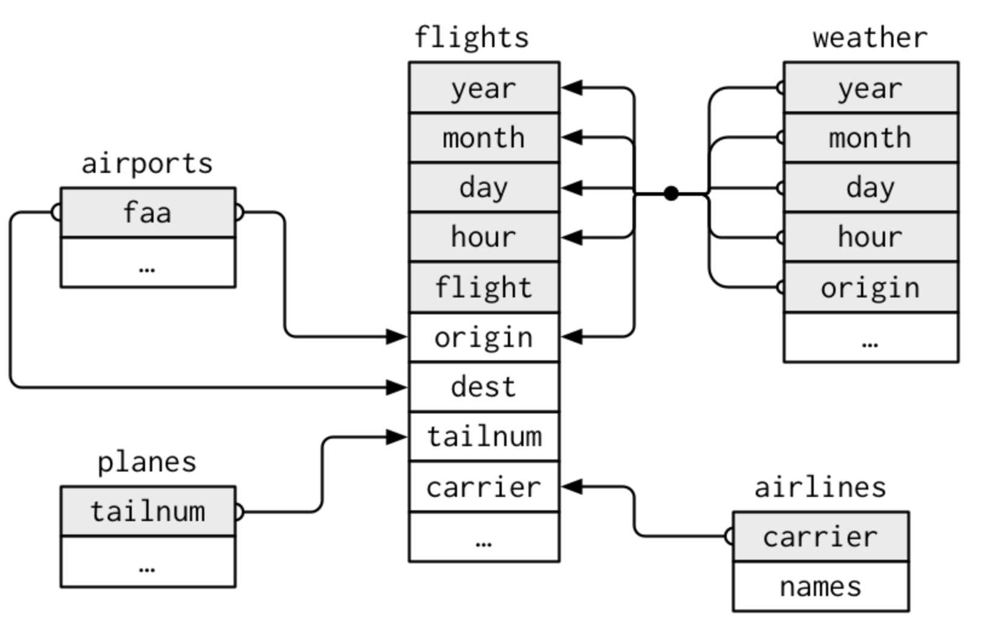

## Farthest airport from New York City
 
### Background
In this exercise you will use various data wrangling tools to answer questions from the data held in separate tables. We’ll use the data in the `nycflights13` package which has relationships between the tables as follows.

### Objective

What is the full name (not the three letter code) of the destination airport farthest from any of the NYC airports in the `flights` table?

Save the name as a character value `farthest_airport`.

### Tasks

- Join two datasets using a common column
- Answer a question that requires understanding how multiple tables are related
= Save your script as a .R or .Rmd in your course repository
