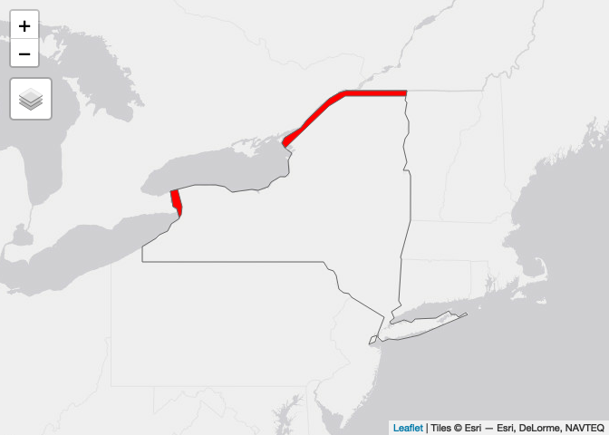

Case Study 05: Beware the Canadians!
================
Qingqing Chen
Last compiled date:13 October, 2021

## Load data

``` r
#load 'world' data from spData package
data(world)  
# load 'states' boundaries from spData package
data(us_states)
```

``` r
#quick view 
plot(world[1]) 
```

<!-- -->

``` r
plot(us_states[1])
```

<!-- -->

## Reproject spatial data

``` r
# check world crs 
st_crs(world)
```

    ## Coordinate Reference System:
    ##   User input: EPSG:4326 
    ##   wkt:
    ## GEOGCRS["WGS 84",
    ##     DATUM["World Geodetic System 1984",
    ##         ELLIPSOID["WGS 84",6378137,298.257223563,
    ##             LENGTHUNIT["metre",1]]],
    ##     PRIMEM["Greenwich",0,
    ##         ANGLEUNIT["degree",0.0174532925199433]],
    ##     CS[ellipsoidal,2],
    ##         AXIS["geodetic latitude (Lat)",north,
    ##             ORDER[1],
    ##             ANGLEUNIT["degree",0.0174532925199433]],
    ##         AXIS["geodetic longitude (Lon)",east,
    ##             ORDER[2],
    ##             ANGLEUNIT["degree",0.0174532925199433]],
    ##     USAGE[
    ##         SCOPE["Horizontal component of 3D system."],
    ##         AREA["World."],
    ##         BBOX[-90,-180,90,180]],
    ##     ID["EPSG",4326]]

## Spatial intersection

``` r
albers <- "+proj=aea +lat_1=29.5 +lat_2=45.5 +lat_0=37.5 +lon_0=-96 +x_0=0 +y_0=0 +ellps=GRS80 +datum=NAD83 +units=m +no_defs"

canada_buffer <-  world %>% 
  st_transform(crs = albers) %>% 
  filter(name_long == "Canada") %>% 
  st_buffer(dist = 10000)

ny <-  us_states %>% 
  st_transform(crs = albers) %>% 
  filter(NAME == "New York")

intersection <- st_intersection(canada_buffer, ny)
```

## Visualize

``` r
# method 1
ggplot() +
  geom_sf(data = ny) +
  geom_sf(data = intersection, fill = "red")
```

<!-- -->

``` r
# method 2
tmap_mode("view")
tm_shape(ny) +
  tm_borders() +
  tm_shape(intersection) +
  tm_polygons(col = "red")
```

<!-- -->

## Calculate area

``` r
area <- intersection %>% 
  st_area() %>% 
  set_units(km^2)

print(paste("The intersected area (red color) is around", round(area, 2), "km\u00B2"))
```

    ## [1] "The intersected area (red color) is around 3495.19 km²"
