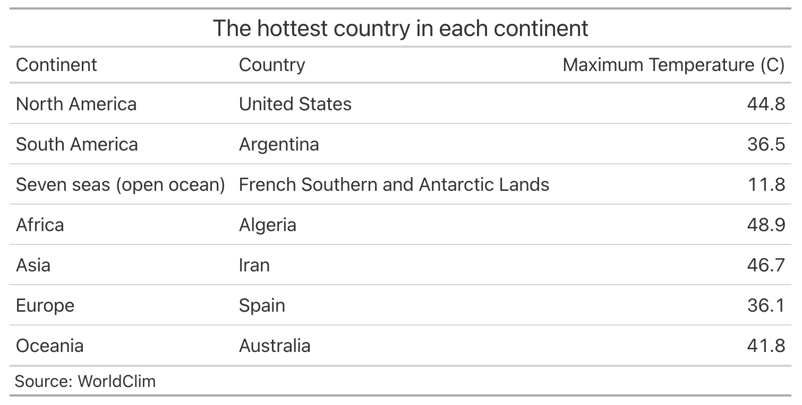

 
```{r setup, include=FALSE}
knitr::opts_chunk$set(echo = T, warning = F, message = F)
library(dplyr)
library(tidyverse)
library(gt)
library(ggplot2)
library(raster)
library(sp)
library(sf)
library(spData)
library(tmap)
```

## Load data 
```{r}
#load 'world' data from spData package
data(world) 
tmax_monthly <- getData(name = "worldclim", var="tmax", res=10)
```

## Prepare world data 

```{r}
sp_world <- world %>% 
  filter(continent != "Antarctica") %>% 
  as(.,"Spatial")
```

## Prepare climate data 
```{r}
# overview
plot(tmax_monthly) 
```

```{r}
gain(tmax_monthly) <- 1/10
tmax_annual <- max(tmax_monthly)
names(tmax_annual) <- "tmax"
```

## Calculate the maximum temperature observed in each country

```{r}
# extract the max temp 
sf_tmax <- raster::extract(tmax_annual, sp_world, fun = max, na.rm = T, small = T, sp = T) %>% 
  st_as_sf()
```


## Communicate the results

### Spatial distribution of the annual maximum temperature
```{r}
# method 1
ggplot(sf_tmax) +
  geom_sf(aes(fill = tmax)) + 
  scale_fill_viridis_c(name="Annual\nMaximum\nTemperature (C)") + 
  theme_minimal() + 
  theme(legend.position = 'bottom') 

# method 2
tm_shape(sf_tmax) +
  tm_polygons(col = "tmax", 
              style = "cont",
              palette = "viridis", 
              n = 7, 
              title = 'Annual Maximum Temperature(C)') +
  tm_layout(legend.outside = F, 
            legend.text.size = 0.6, 
            legend.title.size = 0.75, 
            frame = F)
```

### The hottest country in each continent
```{r eval=F}
sf_tmax %>% 
  st_set_geometry(NULL) %>% 
  group_by(continent) %>% 
  dplyr::select(continent, name_long, tmax) %>% 
  top_n(1) %>% 
  ungroup() %>% 
  gt() %>% 
  cols_label(
    continent = "Continent", 
    name_long = "Country", 
    tmax = "Maximum Temperature (C)"
  ) %>% 
  tab_header(
    title = "The hottest country in each continent", 
  ) %>% 
  tab_source_note(
    source_note = "Source: WorldClim"
  )
```


