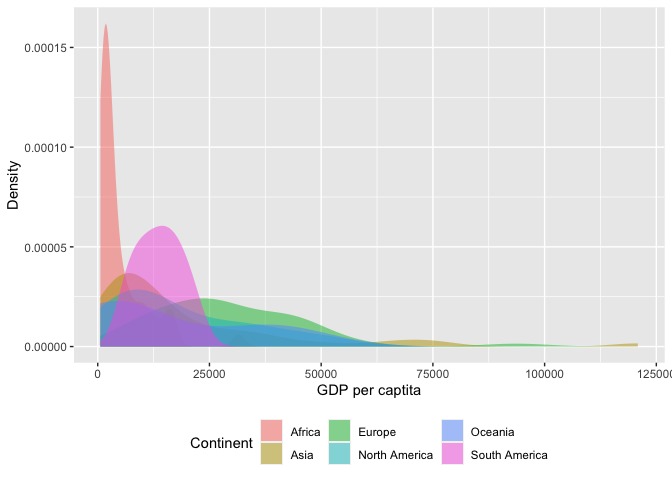

Case Study 07: Getting Help!
================
Qingqing Chen
19 October, 2021

## Load data

``` r
data(world)
```

## Visualization

``` r
world %>%
  ggplot(., aes(gdpPercap, fill = continent)) +
  geom_density(alpha=0.5, color=F) +
  theme(legend.position = "bottom") +
  labs(fill = "Continent", x = "GDP per captita", y = "Density")
```

<!-- -->

## Example repex

``` r
library(spData)
library(ggplot2)
data(world)
ggplot(world, aes(x = gdpPercap, y = continent, color = continent)) +
  geom_density(alpha=0.5,color=F)
reprex(venue="gh")
```
