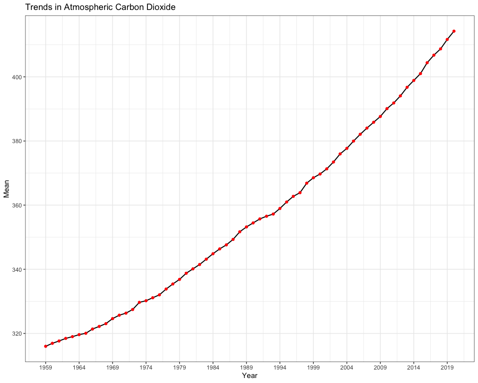
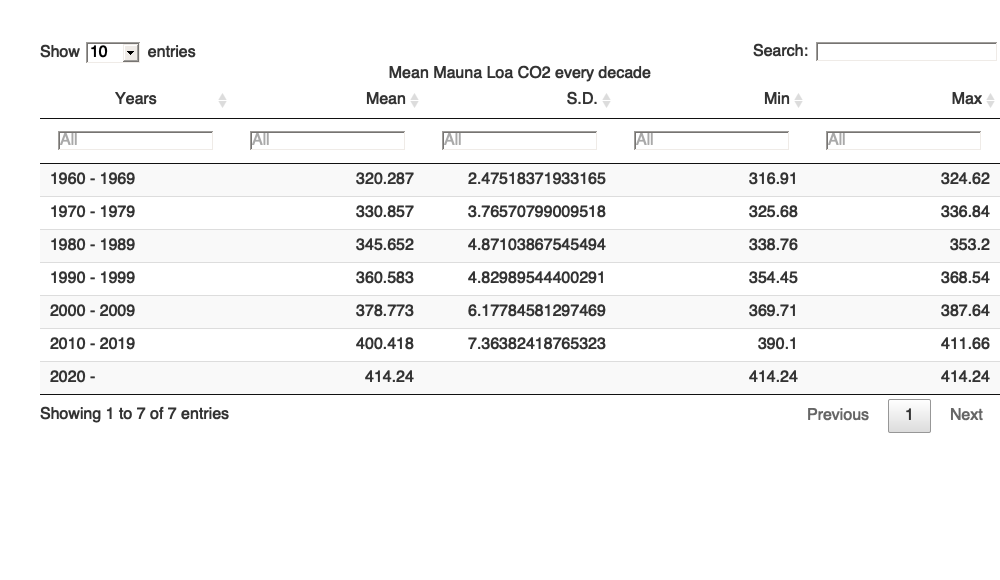

Case Study 08: One Script, Many Products
================
Qingqing Chen
28 October, 2021

## Load data

``` r
url <- "ftp://aftp.cmdl.noaa.gov/products/trends/co2/co2_annmean_mlo.txt"
df <- read.table(url, col.names = c("year", "mean", "unc"))
```

## Visualize

``` r
#Use ggplot to plot a time series of CO2 levels through time
min_year <- df$year %>% min()
max_year <- df$year %>% max()
df %>% 
  mutate(sd = sd(mean)) %>% 
  as_tibble() %>% 
  ggplot(., aes(x = year, y = mean)) +
  geom_line(color = "black", lwd = 0.7) +
  geom_point(size = 1.5, color = "red") +
  scale_x_continuous(breaks = seq(min_year, max_year, 5)) +
  theme_bw() +
  labs(x = "Year", y = "Mean", 
       title= "Trends in Atmospheric Carbon Dioxide")
```

<!-- -->

## Creat table

### Method 1

``` r
# statistical summary
summ <- df %>% 
  slice(-1) %>% 
  mutate(Years = case_when(
    year %in% seq(1960, 1969) ~ "1960 - 1969", 
    year %in% seq(1970, 1979) ~ "1970 - 1979", 
    year %in% seq(1980, 1989) ~ "1980 - 1989", 
    year %in% seq(1990, 1999) ~ "1990 - 1999", 
    year %in% seq(2000, 2009) ~ "2000 - 2009", 
    year %in% seq(2010, 2019) ~ "2010 - 2019", 
    year %in% seq(2020, 2029) ~ "2020 -  "
  )) %>% 
  group_by(Years) %>% 
  dplyr::summarise(Mean = mean(mean), 
                   S.D. = sd(mean), 
                   Min = min(mean), 
                   Max = max(mean)) 
```

``` r
# suitable for github doc output
knitr::kable(summ)
```

<table>
<thead>
<tr>
<th style="text-align:left;">
Years
</th>
<th style="text-align:right;">
Mean
</th>
<th style="text-align:right;">
S.D.
</th>
<th style="text-align:right;">
Min
</th>
<th style="text-align:right;">
Max
</th>
</tr>
</thead>
<tbody>
<tr>
<td style="text-align:left;">
1960 - 1969
</td>
<td style="text-align:right;">
320.287
</td>
<td style="text-align:right;">
2.475184
</td>
<td style="text-align:right;">
316.91
</td>
<td style="text-align:right;">
324.62
</td>
</tr>
<tr>
<td style="text-align:left;">
1970 - 1979
</td>
<td style="text-align:right;">
330.857
</td>
<td style="text-align:right;">
3.765708
</td>
<td style="text-align:right;">
325.68
</td>
<td style="text-align:right;">
336.84
</td>
</tr>
<tr>
<td style="text-align:left;">
1980 - 1989
</td>
<td style="text-align:right;">
345.652
</td>
<td style="text-align:right;">
4.871039
</td>
<td style="text-align:right;">
338.76
</td>
<td style="text-align:right;">
353.20
</td>
</tr>
<tr>
<td style="text-align:left;">
1990 - 1999
</td>
<td style="text-align:right;">
360.583
</td>
<td style="text-align:right;">
4.829895
</td>
<td style="text-align:right;">
354.45
</td>
<td style="text-align:right;">
368.54
</td>
</tr>
<tr>
<td style="text-align:left;">
2000 - 2009
</td>
<td style="text-align:right;">
378.773
</td>
<td style="text-align:right;">
6.177846
</td>
<td style="text-align:right;">
369.71
</td>
<td style="text-align:right;">
387.64
</td>
</tr>
<tr>
<td style="text-align:left;">
2010 - 2019
</td>
<td style="text-align:right;">
400.418
</td>
<td style="text-align:right;">
7.363824
</td>
<td style="text-align:right;">
390.10
</td>
<td style="text-align:right;">
411.66
</td>
</tr>
<tr>
<td style="text-align:left;">
2020 -
</td>
<td style="text-align:right;">
414.240
</td>
<td style="text-align:right;">
NA
</td>
<td style="text-align:right;">
414.24
</td>
<td style="text-align:right;">
414.24
</td>
</tr>
</tbody>
</table>

``` r
# %>% as_image(width = 10, file = "table.png")
```

``` r
# suitable for html output 
kbl(summ,
  caption = "Mean Mauna Loa CO2 every decade", 
  format = "html", table.attr = "style='width:50%;'") %>%
  kableExtra::kable_styling(bootstrap_options = "striped",
  position = "float_right") 
```

### Method 2

``` r
# suitable for html output
DT::datatable(summ, 
                caption = 'Mean Mauna Loa CO2 every decade', 
                rownames = F,
                filter = 'top')
```

<!-- -->

## Render output files

``` r
rmarkdown::render("week_08/case_study_08.Rmd", output_format = "all")
```
