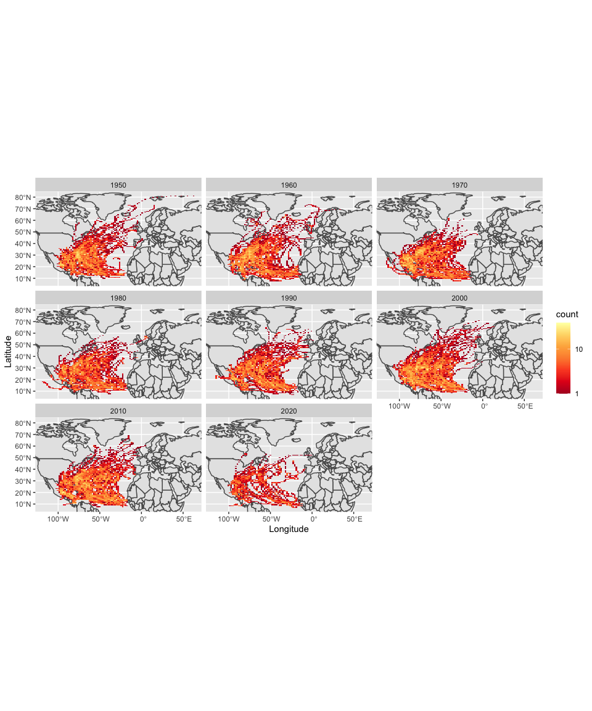

Case Study 09: Tracking Hurricanes!
================
Qingqing Chen
09 November, 2021

## Load data

``` r
data(world)
data(us_states)
```

``` r
# Download zipped data from noaa with storm track information
dataurl <- "https://www.ncei.noaa.gov/data/international-best-track-archive-for-climate-stewardship-ibtracs/v04r00/access/shapefile/IBTrACS.NA.list.v04r00.points.zip"
tdir <- tempdir()
download.file(dataurl, destfile = file.path(tdir,"temp.zip"))
unzip(file.path(tdir,"temp.zip"), exdir = tdir)
list.files(tdir)
```

    ## [1] "IBTrACS.NA.list.v04r00.points.dbf" "IBTrACS.NA.list.v04r00.points.prj"
    ## [3] "IBTrACS.NA.list.v04r00.points.shp" "IBTrACS.NA.list.v04r00.points.shx"
    ## [5] "temp.zip"

``` r
storm_data <- read_sf(list.files(tdir, pattern=".shp", full.names = T))
names(storm_data)
```

    ##   [1] "SID"        "SEASON"     "NUMBER"     "BASIN"      "SUBBASIN"  
    ##   [6] "NAME"       "ISO_TIME"   "NATURE"     "LAT"        "LON"       
    ##  [11] "WMO_WIND"   "WMO_PRES"   "WMO_AGENCY" "TRACK_TYPE" "DIST2LAND" 
    ##  [16] "LANDFALL"   "IFLAG"      "USA_AGENCY" "USA_ATCFID" "USA_LAT"   
    ##  [21] "USA_LON"    "USA_RECORD" "USA_STATUS" "USA_WIND"   "USA_PRES"  
    ##  [26] "USA_SSHS"   "USA_R34_NE" "USA_R34_SE" "USA_R34_SW" "USA_R34_NW"
    ##  [31] "USA_R50_NE" "USA_R50_SE" "USA_R50_SW" "USA_R50_NW" "USA_R64_NE"
    ##  [36] "USA_R64_SE" "USA_R64_SW" "USA_R64_NW" "USA_POCI"   "USA_ROCI"  
    ##  [41] "USA_RMW"    "USA_EYE"    "TOK_LAT"    "TOK_LON"    "TOK_GRADE" 
    ##  [46] "TOK_WIND"   "TOK_PRES"   "TOK_R50_DR" "TOK_R50_L"  "TOK_R50_S" 
    ##  [51] "TOK_R30_DR" "TOK_R30_L"  "TOK_R30_S"  "TOK_LAND"   "CMA_LAT"   
    ##  [56] "CMA_LON"    "CMA_CAT"    "CMA_WIND"   "CMA_PRES"   "HKO_LAT"   
    ##  [61] "HKO_LON"    "HKO_CAT"    "HKO_WIND"   "HKO_PRES"   "NEW_LAT"   
    ##  [66] "NEW_LON"    "NEW_GRADE"  "NEW_WIND"   "NEW_PRES"   "NEW_CI"    
    ##  [71] "NEW_DP"     "NEW_POCI"   "REU_LAT"    "REU_LON"    "REU_TYPE"  
    ##  [76] "REU_WIND"   "REU_PRES"   "REU_TNUM"   "REU_CI"     "REU_RMW"   
    ##  [81] "REU_R34_NE" "REU_R34_SE" "REU_R34_SW" "REU_R34_NW" "REU_R50_NE"
    ##  [86] "REU_R50_SE" "REU_R50_SW" "REU_R50_NW" "REU_R64_NE" "REU_R64_SE"
    ##  [91] "REU_R64_SW" "REU_R64_NW" "BOM_LAT"    "BOM_LON"    "BOM_TYPE"  
    ##  [96] "BOM_WIND"   "BOM_PRES"   "BOM_TNUM"   "BOM_CI"     "BOM_RMW"   
    ## [101] "BOM_R34_NE" "BOM_R34_SE" "BOM_R34_SW" "BOM_R34_NW" "BOM_R50_NE"
    ## [106] "BOM_R50_SE" "BOM_R50_SW" "BOM_R50_NW" "BOM_R64_NE" "BOM_R64_SE"
    ## [111] "BOM_R64_SW" "BOM_R64_NW" "BOM_ROCI"   "BOM_POCI"   "BOM_EYE"   
    ## [116] "BOM_POS_FL" "BOM_PRS_FL" "NAD_LAT"    "NAD_LON"    "NAD_CAT"   
    ## [121] "NAD_WIND"   "NAD_PRES"   "WEL_LAT"    "WEL_LON"    "WEL_WIND"  
    ## [126] "WEL_PRES"   "DS8_LAT"    "DS8_LON"    "DS8_STAGE"  "DS8_WIND"  
    ## [131] "DS8_PRES"   "TD6_LAT"    "TD6_LON"    "TD6_STAGE"  "TD6_WIND"  
    ## [136] "TD6_PRES"   "TD5_LAT"    "TD5_LON"    "TD5_WIND"   "TD5_PRES"  
    ## [141] "TD5_ROCI"   "NEU_LAT"    "NEU_LON"    "NEU_CLASS"  "NEU_WIND"  
    ## [146] "NEU_PRES"   "MLC_LAT"    "MLC_LON"    "MLC_CLASS"  "MLC_WIND"  
    ## [151] "MLC_PRES"   "USA_GUST"   "BOM_GUST"   "BOM_GUSTP"  "REU_GUST"  
    ## [156] "REU_GUSTP"  "USA_SEAHGT" "USA_SEA_NE" "USA_SEA_SE" "USA_SEA_SW"
    ## [161] "USA_SEA_NW" "STORM_SPD"  "STORM_DR"   "year"       "month"     
    ## [166] "day"        "hour"       "min"        "geometry"

``` r
head(storm_data[1:3, 1:3])
```

    ## Simple feature collection with 3 features and 3 fields
    ## Geometry type: POINT
    ## Dimension:     XY
    ## Bounding box:  xmin: -91 ymin: 26.1 xmax: -90.4 ymax: 26.3
    ## Geodetic CRS:  WGS 84
    ## # A tibble: 3 × 4
    ##   SID           SEASON NUMBER     geometry
    ##   <chr>          <int>  <int>  <POINT [°]>
    ## 1 1851175N26270   1851      5 (-90.4 26.1)
    ## 2 1851175N26270   1851      5 (-90.7 26.2)
    ## 3 1851175N26270   1851      5   (-91 26.3)

``` r
#Filter to storms 1950-present
storms <- storm_data %>% 
  filter(year >= 1950) %>% 
  mutate_if(is.numeric, function(x) ifelse(x == -999.0, NA, x)) %>% 
  mutate(decade = (floor(year/10)*10)) 

region <- st_bbox(storm_data)

ggplot() +
  geom_sf(data = world) +
  stat_bin2d(data = storms, aes(y = st_coordinates(storms)[,2], x = st_coordinates(storms)[,1]), bins = 100) + 
  facet_wrap(~decade) +
  scale_fill_distiller(palette="YlOrRd", 
                       trans="log", 
                       direction=-1, 
                       breaks = c(1,10,100,1000)) + 
  coord_sf(ylim=region[c(2,4)], xlim=region[c(1,3)]) +
  labs(x = "Longitude", y = "Latitude")
```

<!-- -->

``` r
states <- us_states %>% 
  st_transform(crs = st_crs(storms)) %>% 
  rename(state = NAME)

storm_states <- st_join(storms, states, join = st_intersects, left = F)

top5_states <- storm_states %>% 
  st_set_geometry(NULL) %>% 
  group_by(state) %>% 
  dplyr::summarize(storms = length(unique(NAME))) %>% 
  arrange(desc(storms)) %>% 
  slice(1:5)

top5_states
```

    ## # A tibble: 5 × 2
    ##   state          storms
    ##   <chr>           <int>
    ## 1 Florida            84
    ## 2 North Carolina     64
    ## 3 Georgia            60
    ## 4 Texas              54
    ## 5 Louisiana          52
