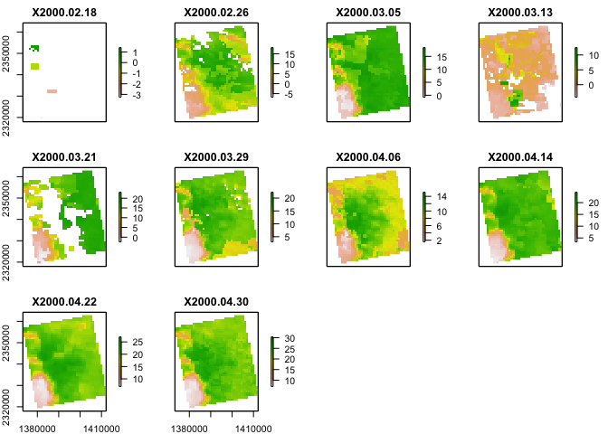

Case Study 10: Satellite Remote Sensing
================
Qingqing Chen
09 November, 2021

## Land Use Land Cover

### Load data

``` r
# Create a folder to hold the downloaded data
dir.create("data", showWarnings = F) #create a folder to hold the data

lulc_url <- "https://github.com/adammwilson/DataScienceData/blob/master/inst/extdata/appeears/MCD12Q1.051_aid0001.nc?raw=true"
lst_url <- "https://github.com/adammwilson/DataScienceData/blob/master/inst/extdata/appeears/MOD11A2.006_aid0001.nc?raw=true"

# download them
download.file(lulc_url,destfile = "data/MCD12Q1.051_aid0001.nc", mode = "wb")
download.file(lst_url,destfile = "data/MOD11A2.006_aid0001.nc", mode = "wb")

# load data 
lulc <- stack("data/MCD12Q1.051_aid0001.nc",varname="Land_Cover_Type_1")
```

    ## [1] ">>>> WARNING <<<  attribute latitude_of_projection_origin is an 8-byte value, but R"
    ## [1] "does not support this data type. I am returning a double precision"
    ## [1] "floating point, but you must be aware that this could lose precision!"
    ## [1] ">>>> WARNING <<<  attribute longitude_of_central_meridian is an 8-byte value, but R"
    ## [1] "does not support this data type. I am returning a double precision"
    ## [1] "floating point, but you must be aware that this could lose precision!"
    ## [1] ">>>> WARNING <<<  attribute longitude_of_projection_origin is an 8-byte value, but R"
    ## [1] "does not support this data type. I am returning a double precision"
    ## [1] "floating point, but you must be aware that this could lose precision!"
    ## [1] ">>>> WARNING <<<  attribute straight_vertical_longitude_from_pole is an 8-byte value, but R"
    ## [1] "does not support this data type. I am returning a double precision"
    ## [1] "floating point, but you must be aware that this could lose precision!"
    ## [1] ">>>> WARNING <<<  attribute false_easting is an 8-byte value, but R"
    ## [1] "does not support this data type. I am returning a double precision"
    ## [1] "floating point, but you must be aware that this could lose precision!"
    ## [1] ">>>> WARNING <<<  attribute false_northing is an 8-byte value, but R"
    ## [1] "does not support this data type. I am returning a double precision"
    ## [1] "floating point, but you must be aware that this could lose precision!"

``` r
lst <- stack("data/MOD11A2.006_aid0001.nc",varname="LST_Day_1km")
```

    ## [1] ">>>> WARNING <<<  attribute latitude_of_projection_origin is an 8-byte value, but R"
    ## [1] "does not support this data type. I am returning a double precision"
    ## [1] "floating point, but you must be aware that this could lose precision!"
    ## [1] ">>>> WARNING <<<  attribute longitude_of_central_meridian is an 8-byte value, but R"
    ## [1] "does not support this data type. I am returning a double precision"
    ## [1] "floating point, but you must be aware that this could lose precision!"
    ## [1] ">>>> WARNING <<<  attribute longitude_of_projection_origin is an 8-byte value, but R"
    ## [1] "does not support this data type. I am returning a double precision"
    ## [1] "floating point, but you must be aware that this could lose precision!"
    ## [1] ">>>> WARNING <<<  attribute straight_vertical_longitude_from_pole is an 8-byte value, but R"
    ## [1] "does not support this data type. I am returning a double precision"
    ## [1] "floating point, but you must be aware that this could lose precision!"
    ## [1] ">>>> WARNING <<<  attribute false_easting is an 8-byte value, but R"
    ## [1] "does not support this data type. I am returning a double precision"
    ## [1] "floating point, but you must be aware that this could lose precision!"
    ## [1] ">>>> WARNING <<<  attribute false_northing is an 8-byte value, but R"
    ## [1] "does not support this data type. I am returning a double precision"
    ## [1] "floating point, but you must be aware that this could lose precision!"

### Explore LULC data

``` r
plot(lulc)
```

<!-- -->

``` r
# pick one year to work with 
lulc <- lulc[[13]]
plot(lulc)
```

<!-- -->

### Process landcover data

``` r
# Assign land cover clases from MODIS website
Land_Cover_Type_1 <-  c(
    Water = 0, 
    `Evergreen Needleleaf forest` = 1, 
    `Evergreen Broadleaf forest` = 2,
    `Deciduous Needleleaf forest` = 3, 
    `Deciduous Broadleaf forest` = 4,
    `Mixed forest` = 5, 
    `Closed shrublands` = 6,
    `Open shrublands` = 7,
    `Woody savannas` = 8, 
    Savannas = 9,
    Grasslands = 10,
    `Permanent wetlands` = 11, 
    Croplands = 12,
    `Urban & built-up` = 13,
    `Cropland/Natural vegetation mosaic` = 14, 
    `Snow & ice` = 15,
    `Barren/Sparsely vegetated` = 16, 
    Unclassified = 254,
    NoDataFill = 255)
```

``` r
lcd <- data.frame(
  ID = Land_Cover_Type_1,
  landcover = names(Land_Cover_Type_1),
  col = c("#000080","#008000","#00FF00", "#99CC00","#99FF99", "#339966", "#993366", "#FFCC99", "#CCFFCC", "#FFCC00", "#FF9900", "#006699", "#FFFF00", "#FF0000", "#999966", "#FFFFFF", "#808080", "#000000", "#000000"),
  stringsAsFactors = F)
# colors from https://lpdaac.usgs.gov/about/news_archive/modisterra_land_cover_types_yearly_l3_global_005deg_cmg_mod12c1
kable(head(lcd))
```

|                             |  ID | landcover                   | col     |
|:----------------------------|----:|:----------------------------|:--------|
| Water                       |   0 | Water                       | #000080 |
| Evergreen Needleleaf forest |   1 | Evergreen Needleleaf forest | #008000 |
| Evergreen Broadleaf forest  |   2 | Evergreen Broadleaf forest  | #00FF00 |
| Deciduous Needleleaf forest |   3 | Deciduous Needleleaf forest | #99CC00 |
| Deciduous Broadleaf forest  |   4 | Deciduous Broadleaf forest  | #99FF99 |
| Mixed forest                |   5 | Mixed forest                | #339966 |

``` r
# Convert LULC raster into a ‘factor’ (categorical) raster. 
# This requires building the Raster Attribute Table (RAT). 
# convert to raster (easy)
lulc <- as.factor(lulc)

# update the RAT with a left join
levels(lulc) <- left_join(levels(lulc)[[1]], lcd, by = "ID")

# plot it
gplot(lulc) +
  geom_raster(aes(fill = as.factor(value))) +
  scale_fill_manual(values = levels(lulc)[[1]]$col,
                    labels = levels(lulc)[[1]]$landcover,
                    name = "Landcover Type") +
  coord_equal() +
  theme(legend.position = "bottom")+
  guides(fill = guide_legend(ncol = 5, nrow = 3, byrow = TRUE))
```

<!-- -->

## Land Surface Temperature

``` r
plot(lst[[1:12]])
```

<!-- -->

### Convert LST to Degrees

``` r
# offs(): Gain and offset of values on file
offs(lst) <-  -273.15
plot(lst[[1:10]])
```

<!-- -->

### Add Dates to Z (time) dimension

``` r
# The default layer names of the LST file include the date as follows
names(lst)[1:5]
```

    ## [1] "X2000.02.18" "X2000.02.26" "X2000.03.05" "X2000.03.13" "X2000.03.21"

``` r
# Convert those values to a proper R Date format by dropping the “X” and using as.Date()
tdates <- names(lst) %>%
  gsub(pattern = "X", replacement = "", .) %>% 
  as.Date("%Y.%m.%d")

names(lst) <- 1:nlayers(lst)
lst <- setZ(lst, tdates) # Get or set z-values
```

### Extract timeseries for a point

``` r
lw <- SpatialPoints(data.frame(x = -78.791547, y = 43.007211))
projection(lw) <- "+proj=longlat"
lw <- lw %>% spTransform(CRSobj = crs(lst))
lw_data <- raster::extract(lst, lw, buffer = 1000, fun = mean, na.rm = T) %>%
  t() %>% 
  as.data.frame() %>% 
  rownames_to_column(var = "id") %>% 
  as_tibble() %>% 
  rename(Temperature = V1) %>% 
  mutate(Date = getZ(lst))

lw_data %>% 
  ggplot(., aes(x = Date, y = Temperature)) + 
  geom_point() +
  geom_line(color = "blue") +
  geom_smooth(n = 300, span = 0.01) +
  theme_bw()
```

<!-- -->

### Summarize weekly data to monthly climatologies

``` r
tmonth <- as.numeric(format(getZ(lst),"%m"))
lst_month <- stackApply(lst, tmonth, fun = mean)
names(lst_month) <-  month.name

# plot(lst_month)
gplot(lst_month) + 
  geom_tile(aes(fill = value)) +
  facet_wrap(~ variable) +
  scale_fill_gradient(low = 'blue', high = 'orange') +
  # coord_equal() +
  coord_sf(datum = NA) 
```

<!-- -->

``` r
cellStats(lst_month, mean) %>% 
  as.data.frame() %>% 
  rename(Mean = ".") %>% 
  kable()
```

|           |      Mean |
|:----------|----------:|
| January   | -2.127506 |
| February  |  8.710271 |
| March     | 18.172077 |
| April     | 23.173591 |
| May       | 26.990005 |
| June      | 28.840144 |
| July      | 27.358260 |
| August    | 22.927727 |
| September | 15.477510 |
| October   |  8.329881 |
| November  |  0.586179 |
| December  | -4.754134 |
