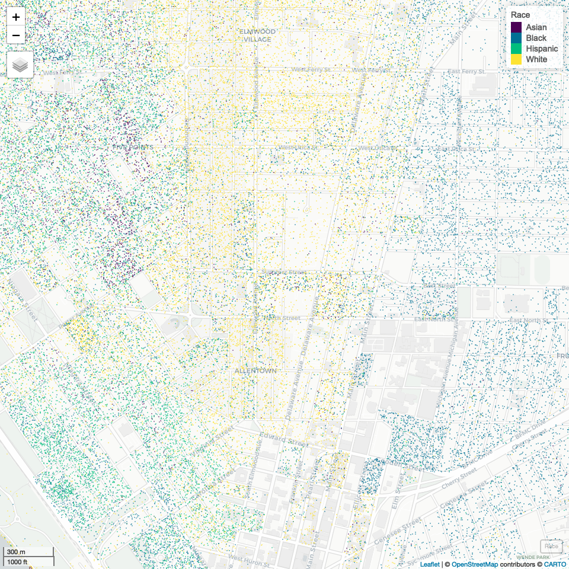

Case Study 11: Parallel Computing with R
================
Qingqing Chen
16 November, 2021

## Load data

``` r
racevars <- c(White = "P005003", 
              Black = "P005004", 
              Asian = "P005006", 
              Hispanic = "P004003")
options(tigris_use_cache = TRUE)
erie <- get_decennial(geography = "block", variables = racevars, 
                      state = "NY", county = "Erie County", geometry = TRUE,
                      summary_var = "P001001", cache_table=T) 
head(erie)
```

    ## Simple feature collection with 6 features and 5 fields
    ## Geometry type: MULTIPOLYGON
    ## Dimension:     XY
    ## Bounding box:  xmin: -78.81094 ymin: 42.51384 xmax: -78.47691 ymax: 43.01388
    ## Geodetic CRS:  NAD83
    ## # A tibble: 6 × 6
    ##   GEOID           NAME    variable value summary_value                  geometry
    ##   <chr>           <chr>   <chr>    <dbl>         <dbl>        <MULTIPOLYGON [°]>
    ## 1 360290175022008 Block … White       21            21 (((-78.81088 42.51984, -…
    ## 2 360290175022008 Block … Black        0            21 (((-78.81088 42.51984, -…
    ## 3 360290175022008 Block … Asian        0            21 (((-78.81088 42.51984, -…
    ## 4 360290175022008 Block … Hispanic     0            21 (((-78.81088 42.51984, -…
    ## 5 360290148033003 Block … White      120           130 (((-78.48012 43.01069, -…
    ## 6 360290148033003 Block … Black        0           130 (((-78.48012 43.01069, -…

## Crop the county-level data

``` r
bbox <- c(xmin=-78.9, xmax=-78.85, ymin=42.888, ymax=42.92)
erie_sub <- st_crop(erie, bbox)
head(erie_sub)
```

    ## Simple feature collection with 6 features and 5 fields
    ## Geometry type: POLYGON
    ## Dimension:     XY
    ## Bounding box:  xmin: -78.89893 ymin: 42.89628 xmax: -78.85625 ymax: 42.92
    ## Geodetic CRS:  NAD83
    ## # A tibble: 6 × 6
    ##   GEOID           NAME    variable value summary_value                  geometry
    ##   <chr>           <chr>   <chr>    <dbl>         <dbl>             <POLYGON [°]>
    ## 1 360290061001020 Block … White       24            34 ((-78.8987 42.92, -78.89…
    ## 2 360290061001020 Block … Black        6            34 ((-78.8987 42.92, -78.89…
    ## 3 360290061001020 Block … Asian        2            34 ((-78.8987 42.92, -78.89…
    ## 4 360290061001020 Block … Hispanic     2            34 ((-78.8987 42.92, -78.89…
    ## 5 360290025022003 Block … White        0             0 ((-78.85705 42.89666, -7…
    ## 6 360290025022003 Block … Black        0             0 ((-78.85705 42.89666, -7…

``` r
print(paste0("The number of features reduced from ", nrow(erie), " to ", nrow(erie_sub), "!"))
```

    ## [1] "The number of features reduced from 54200 to 2732!"

## Parallel computing

``` r
generate_points <- function(df, r){
  df %>%  # df is the reduced enri dataset
    filter(., variable==r) %>%  # filter by race
    st_sample(., size = .$value) %>% # generate random points 
    st_as_sf() %>%  # convert to sf object 
    mutate(variable = r) %>% # add race variable
    rename(geometry = x) # rename the geometry column 
}
# parallel computing
if(file.exists(here("data/new_erie_sub.rds"))){
  new_erie_sub <- readRDS(here::here("data/new_erie_sub.rds"))
}else{
  new_erie_sub <- foreach(r=unique(erie_sub$variable),.combine=rbind) %dopar% {generate_points(erie_sub, r)}
  saveRDS(new_erie_sub, here::here("data/new_erie_sub.rds"))
}
```

## Visualize

``` r
cntr_crds <- c(mean(bbox[1:2]), mean(bbox[3:4]))
m <- mapview(new_erie_sub, 
        zcol = "variable", 
        cex = 0.1, 
        lwd = 0, 
        layer.name = "Race") 
m@map %>% 
  leaflet::setView(., cntr_crds[1], cntr_crds[2], zoom = 14.5)
```

<!-- -->
